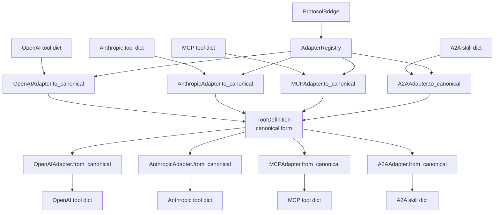

# aumai-protocolbridge

**Translate between agent communication protocols — MCP, A2A, OpenAI, Anthropic.**

Part of the [AumAI](https://github.com/aumai) open-source infrastructure suite for agentic AI systems.

[](https://github.com/aumai/aumai-protocolbridge/actions)
[](https://pypi.org/project/aumai-protocolbridge/)
[](LICENSE)
[](https://www.python.org/)

---

## What is this?

Think of the early days of mobile messaging. If you had an iPhone, you could only text
other iPhone users with iMessage. Android users had a different system. A message from
one platform could not natively reach the other. To communicate, you needed a bridge —
something that understood both formats and translated between them.

AI agents face the same problem today. The major AI providers have converged on
incompatible formats for the most important building block of agentic systems: tool
definitions (what a tool is called, what parameters it accepts, what it returns). A tool
defined in Anthropic's format cannot be directly used by an OpenAI client. An MCP server
exposes tools in a format that A2A agents cannot natively read.

`aumai-protocolbridge` is that bridge. It provides bidirectional translation between
four major agent communication protocols: OpenAI function calling, Anthropic tool use,
Model Context Protocol (MCP), and Agent-to-Agent (A2A). It translates tool definitions,
messages, and tool calls, with a validation layer and an extensible adapter system for
adding new protocols.

---

## Why does this matter?

### The problem from first principles

The agentic AI ecosystem is fragmenting along protocol lines at the exact moment it
should be standardizing. Teams building multi-agent systems face a choice: either lock
into a single provider's protocol and sacrifice flexibility, or write bespoke translation
code every time they integrate a new provider.

Neither option is acceptable. Provider lock-in creates strategic risk. Bespoke
translation code is brittle, untested, and must be re-written for every project.

`aumai-protocolbridge` solves this with a canonical intermediate representation. All
protocol formats are translated to and from a `ToolDefinition` model that captures what
every protocol is fundamentally expressing: a name, a description, an input schema, and
a return schema. Translation is then always a two-step process: `source → canonical →
target`.

### Why this design?

The canonical representation pattern means that adding a new protocol requires writing
exactly one adapter (implementing `to_canonical` and `from_canonical`), not N×(N-1)
bidirectional translations for every protocol pair. The `AdapterRegistry` makes this
extensible at runtime.

---

## Architecture



---

## Features

| Feature | Description |
|---|---|
| Four built-in adapters | OpenAI function calling, Anthropic tool use, Model Context Protocol (MCP), Agent-to-Agent (A2A) |
| Bidirectional translation | Any protocol can be translated to any other protocol |
| Tool definition translation | Translate tool schemas between provider formats |
| Message translation | Translate conversation messages between protocol formats |
| Tool call translation | Translate tool call invocations and their responses |
| Validation | `validate_tool()` checks a tool definition against a protocol's structural requirements |
| Translation warnings | `TranslationResult.warnings` surfaces data loss or missing fields without raising exceptions |
| Extensible adapter system | Register custom adapters for any new protocol via `AdapterRegistry.register()` |
| Protocol-agnostic models | `ToolDefinition`, `ToolCall`, `ToolResult`, `Message` provide a shared vocabulary |
| CLI tools | `translate`, `validate`, and `list-protocols` commands for shell and CI workflows |

---

## Quick Start

**Requirements:** Python 3.11+

```bash
# Install
pip install aumai-protocolbridge

# List supported protocols
protocolbridge list-protocols

# Translate a tool definition from OpenAI format to Anthropic format
protocolbridge translate \
  --source openai \
  --target anthropic \
  --input my_tool.json

# Save the translated tool to a file
protocolbridge translate \
  --source openai \
  --target mcp \
  --input my_tool.json \
  --output my_tool_mcp.json

# Validate a tool definition against a protocol
protocolbridge validate --protocol anthropic --input my_tool.json
```

**Example: translate an OpenAI tool to Anthropic format**

`my_tool.json`:
```json
{
  "type": "function",
  "function": {
    "name": "get_weather",
    "description": "Get current weather for a location",
    "parameters": {
      "type": "object",
      "properties": {
        "location": {"type": "string", "description": "City name"}
      },
      "required": ["location"]
    }
  }
}
```

```bash
protocolbridge translate --source openai --target anthropic --input my_tool.json
```

Output:
```json
{
  "name": "get_weather",
  "description": "Get current weather for a location",
  "input_schema": {
    "type": "object",
    "properties": {
      "location": {"type": "string", "description": "City name"}
    },
    "required": ["location"]
  }
}
```

---

## CLI Reference

### `protocolbridge translate`

Translate a tool definition, message, or tool call between protocols.

```
Usage: protocolbridge translate [OPTIONS]

Options:
  --source [mcp|a2a|openai|anthropic]   Source protocol format. [required]
  --target [mcp|a2a|openai|anthropic]   Target protocol format. [required]
  --input PATH                           JSON file containing the object to
                                         translate. [required]
  --type [tool|message|call]             Kind of object to translate.
                                         [default: tool]
  --output PATH                          Write translated JSON to this file.
                                         Default: stdout.
  --help                                 Show this message and exit.
```

**Translation types:**
- `tool` — a tool/function/skill definition
- `message` — a conversation message (`role` + `content` + optional `tool_calls`)
- `call` — a tool call invocation

**Examples:**

```bash
# Translate a tool definition
protocolbridge translate --source openai --target anthropic --input tool.json

# Translate a message from Anthropic format to OpenAI format
protocolbridge translate \
  --source anthropic \
  --target openai \
  --type message \
  --input message.json

# Translate a tool call and save output
protocolbridge translate \
  --source mcp \
  --target openai \
  --type call \
  --input call.json \
  --output call_openai.json

# Translate all protocol directions (example: MCP server tools to OpenAI client)
for tool in mcp_tools/*.json; do
  protocolbridge translate --source mcp --target openai --input "$tool" \
    --output "openai_tools/$(basename $tool)"
done
```

Warnings from the translation (e.g., missing description field) are printed to stderr
and do not affect the exit code.

---

### `protocolbridge validate`

Validate a tool definition against a protocol's structural requirements.

```
Usage: protocolbridge validate [OPTIONS]

Options:
  --protocol [mcp|a2a|openai|anthropic]  Protocol to validate against.
                                          [required]
  --input PATH                            JSON file containing the tool
                                          definition. [required]
  --help                                  Show this message and exit.
```

Exit codes:
- `0` — valid
- `1` — validation failed (issues printed to stdout)

**Examples:**

```bash
# Validate an Anthropic tool definition
protocolbridge validate --protocol anthropic --input tool.json
# Output: Valid anthropic tool definition.

# Validate an MCP tool — exits 1 if invalid
protocolbridge validate --protocol mcp --input tool.json
# Output:
#   Validation failed for protocol 'mcp':
#     - MCP tools require 'inputSchema' field.
```

**Protocol-specific validation rules:**
- `openai`: warns if `type='function'` wrapper or bare function dict is missing
- `anthropic`: requires `input_schema` field
- `mcp`: requires `inputSchema` or `input_schema` field
- `a2a`: requires `skill` wrapper or bare skill dict with `name`

---

### `protocolbridge list-protocols`

List all protocols registered in the adapter registry.

```
Usage: protocolbridge list-protocols

Options:
  --help    Show this message and exit.
```

**Output:**
```
Supported protocols:
  openai
  anthropic
  mcp
  a2a
```

---

## Python API

### Basic translation

```python
from aumai_protocolbridge.core import ProtocolBridge
from aumai_protocolbridge.models import ProtocolType

bridge = ProtocolBridge()  # Loads all built-in adapters

# Translate a tool from OpenAI format to Anthropic format
openai_tool = {
    "type": "function",
    "function": {
        "name": "search_web",
        "description": "Search the web for information",
        "parameters": {
            "type": "object",
            "properties": {
                "query": {"type": "string"}
            },
            "required": ["query"]
        }
    }
}

result = bridge.translate_tool(
    tool_data=openai_tool,
    source=ProtocolType.openai,
    target=ProtocolType.anthropic,
)

print(result.translated)
# {"name": "search_web", "description": "...", "input_schema": {...}}

# Check for warnings
for warning in result.warnings:
    print(f"Warning: {warning}")
```

### Translating messages

```python
# Translate a user message from Anthropic format to OpenAI format
anthropic_message = {
    "role": "user",
    "content": "What is the weather in Tokyo?"
}

result = bridge.translate_message(
    msg=anthropic_message,
    source=ProtocolType.anthropic,
    target=ProtocolType.openai,
)
print(result.translated)
```

### Translating tool calls

```python
# Translate a tool call invocation from MCP to OpenAI
mcp_call = {
    "method": "tools/call",
    "params": {
        "name": "get_weather",
        "arguments": {"location": "Tokyo"}
    }
}

result = bridge.translate_tool_call(
    call=mcp_call,
    source=ProtocolType.mcp,
    target=ProtocolType.openai,
)
print(result.translated)
```

### Validating tool definitions

```python
# Validate before translating to catch structural issues early
issues = bridge.validate_tool(tool_data, ProtocolType.anthropic)
if issues:
    for issue in issues:
        print(f"Issue: {issue}")
else:
    result = bridge.translate_tool(tool_data, ProtocolType.anthropic, ProtocolType.mcp)
```

### Using the adapter registry directly

```python
from aumai_protocolbridge.core import AdapterRegistry, ProtocolBridge
from aumai_protocolbridge.models import ProtocolType, ToolDefinition

# Build a custom registry with only the adapters you need
registry = AdapterRegistry()

from aumai_protocolbridge.adapters.openai import OpenAIAdapter
from aumai_protocolbridge.adapters.anthropic import AnthropicAdapter

registry.register(ProtocolType.openai, OpenAIAdapter())
registry.register(ProtocolType.anthropic, AnthropicAdapter())

bridge = ProtocolBridge(registry=registry)

# Check which protocols are available
supported = bridge._registry.supported_protocols()
print(supported)  # [ProtocolType.openai, ProtocolType.anthropic]
```

### Writing a custom adapter

```python
from typing import Any
from aumai_protocolbridge.models import ToolDefinition, ProtocolType

class MyCustomAdapter:
    """Adapter for a hypothetical custom protocol."""

    def to_canonical(self, data: dict[str, Any]) -> ToolDefinition:
        """Parse custom protocol format into canonical ToolDefinition."""
        return ToolDefinition(
            name=data["tool_name"],
            description=data.get("docs", ""),
            parameters=data.get("args_schema", {}),
        )

    def from_canonical(self, tool: ToolDefinition) -> dict[str, Any]:
        """Render canonical ToolDefinition in custom protocol format."""
        return {
            "tool_name": tool.name,
            "docs": tool.description,
            "args_schema": tool.parameters,
        }

# Register the custom adapter
registry.register(ProtocolType("my_custom"), MyCustomAdapter())
```

### Working with models directly

```python
from aumai_protocolbridge.models import (
    ToolDefinition,
    ToolCall,
    ToolResult,
    Message,
    TranslationResult,
    ProtocolType,
)

# Create a canonical tool definition
tool = ToolDefinition(
    name="calculate_sum",
    description="Add two numbers together",
    parameters={
        "type": "object",
        "properties": {
            "a": {"type": "number"},
            "b": {"type": "number"}
        },
        "required": ["a", "b"]
    },
    returns={"type": "number"},
)

# Create a canonical tool call
call = ToolCall(
    tool_name="calculate_sum",
    arguments={"a": 5, "b": 3},
    call_id="call_abc123",
)

# Create a canonical tool result
result_model = ToolResult(
    call_id="call_abc123",
    result={"value": 8},
    error=None,
)

# Create a canonical message
message = Message(
    role="user",
    content="Please calculate 5 + 3",
    tool_calls=None,
)
```

---

## Configuration Options

`aumai-protocolbridge` is configured through the Python API. The default `ProtocolBridge`
constructor calls `_default_registry()` which pre-populates adapters for all four
built-in protocols.

| Configuration | How | Description |
|---|---|---|
| Custom adapter registry | `ProtocolBridge(registry=my_registry)` | Replace the default registry with a custom one |
| Register additional adapter | `registry.register(ProtocolType.X, adapter)` | Add adapters for new protocols at runtime |
| Override a built-in adapter | `registry.register(ProtocolType.openai, my_adapter)` | Replace a built-in adapter with a custom implementation |

There is no file-based configuration. All protocol behaviour is in the adapter classes.

---

## How it works — Technical Deep-Dive

### The canonical representation

`ToolDefinition` is the hub of the translation graph. It captures the minimal common
structure that all four major protocols express:

- `name` — the callable identifier
- `description` — human-readable documentation
- `parameters` — a JSON Schema `object` describing the input
- `returns` — a JSON Schema object describing the output (not all protocols expose this)

When information present in the source protocol has no canonical equivalent (e.g.,
OpenAI's `strict` mode parameter), it is dropped during `to_canonical()` and a warning
is added to `TranslationResult.warnings`. This design prioritizes correctness over
lossless round-tripping.

### Message translation fallback

`translate_message()` checks whether the source adapter implements
`message_to_canonical()` and whether the target adapter implements
`message_from_canonical()`. If either is missing, it falls back to a generic
`_generic_message_to_canonical()` that maps `role` and `content` fields and appends a
warning. This ensures translation never hard-fails on a missing method.

### Tool call translation

`translate_tool_call()` checks for `tool_call_to_canonical` (OpenAI-style) and
`task_call_to_canonical` (A2A-style) methods on the source adapter, with graceful
fallback to passing the dict through unchanged. This mirrors the message translation
fallback pattern.

### The `ProtocolAdapter` protocol

`ProtocolAdapter` is a `typing.Protocol` with `@runtime_checkable`. This means any class
that implements `to_canonical(data)` and `from_canonical(tool)` satisfies the interface
without inheriting from a base class. `isinstance(my_adapter, ProtocolAdapter)` returns
`True` at runtime without requiring explicit registration.

---

## Integration with other AumAI projects

- **aumai-specs**: When validating agent contracts, use `ProtocolBridge.validate_tool()`
  to check that tool definitions conform to their claimed protocol before running
  contract tests.
- **aumai-agentcve**: Protocol adapter libraries (MCP clients, A2A frameworks) are
  dependencies that should be scanned with `agentcve` for CVEs.
- **aumai-opensafety**: Translation failures or unexpected semantic changes during
  protocol translation can affect safety properties. Log translation warnings that
  involve safety-critical tools as `IncidentCategory.model_failure` incidents in
  `opensafety`.

---

## Contributing

1. Fork the repository
2. Create a feature branch: `git checkout -b feature/new-protocol-adapter`
3. Implement the adapter in `src/aumai_protocolbridge/adapters/yourprotocol.py`
4. Register it in `_default_registry()` in `core.py`
5. Run the test suite: `make test`
6. Run linting: `make lint` (ruff + mypy strict)
7. Conventional commit messages: `feat:`, `fix:`, `refactor:`, `docs:`, `test:`, `chore:`

---

## License

Apache License 2.0. See `LICENSE` for the full text.

```
Copyright 2025 AumAI Contributors

Licensed under the Apache License, Version 2.0 (the "License");
you may not use this file except in compliance with the License.
You may obtain a copy of the License at

    http://www.apache.org/licenses/LICENSE-2.0
```
